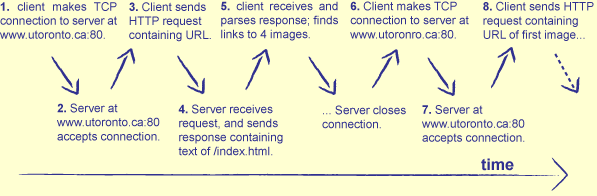
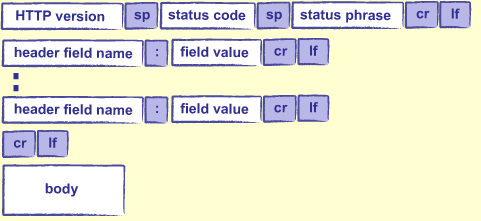

# A Simple Web Server
http://aosabook.org/en/500L/a-simple-web-server.html

```
Author: Greg Wilson
Project: Web Server
Requirements: Python

This directory holds a simple web server in Python, which I am
building up in stages.  Each sub-directory holds a more complex
version; the final chapter will discuss the changes between these
versions in order to explain features, and show how adding them
requires earlier decisions to be revisited or elaborated.

* 00-hello-web: respond with fixed content.
* 01-echo-request-info: show HTTP request headers.
* 02-serve-static: serve static files and directories.
* 03-errcode-pathnorm: error handling, path normalization, and logging.
* 04-mimetypes: MIME types.
* 05-simple-cgi: basic CGI scripts.
* 06-sockets: replace Python HTTP library with our own socket/parsing code.
```

## Introduction
- 웹은 지난 20년 간 수많은 방식으로 사회를 변화시켰지만, 핵심은 거의 변하지 않았다.
  - 대부분의 시스템은 여전히 팀 버너스 리가 25년 전에 제시한 규칙을 따른다. 특히 대부분의 웹 서버는 당시와 동일한 종류의 메시지를 동일한 방식으로 처리한다.

## Background
- 웹의 거의 모든 프로그램은 인터넷 프로토콜(Internet Protocol, IP)이라는 통신 표준 위에서? 실행된다. 
  - 그 통신 표준 중 하나는 전송 제어 프로토콜(TCP/IP)로, 컴퓨터 간의 통신을 파일 읽기/쓰기처럼 보이게 한다.

- IP를 사용하는 프로그램은 **소켓**을 통해 통신한다.
  - 각 소켓은 (전화 통화에서 각 전화가 한쪽 끝에 위치한 것처럼) 지점간(point-to-point) 통신 채널의 한쪽 끝이다. 
- 소켓은 특정 머신을 식별하는 **IP 주소**와 그 머신의 **포트 번호**로 구성된다.
  - IP 주소는 네 개의 8비트 숫자로 구성된다. (예: `174.136.14.108`) DNS(Domain Name System)은 이 숫자를 사람이 기억하기 쉬운 `aosabook.org`와 같은 상징적인 이름과 매치시킨다.
  - 포트 번호는 호스트 머신에 위치한 소켓을 유일하게 식별하기 위한 0-65535 범위의 숫자다. IP 주소가 회사 전화번호라면 포트 번호는 내선이다.

- HTTP(Hypertext Transfer Protocol)은 프로그램이 IP를 통해 데이터를 교환할 수 있는 한 가지 방법을 설명한다. 
  - 클라이언트가 소켓 연결을 통해 원하는 걸 명시한 요청을 봅낸다.
  - 서버는 응답으로 데이터를 전송한다.
    - 응답 데이터는 디스크의 파일에서 복사되거나, 프로그램에 의해 동적으로 생성되거나, 둘이 혼합될 수 있다.



### HTTP 요청
- HTTP 요청에서 가장 중요한 것은 요청은 단지 텍스트일 뿐이라는 것이다. 어떤 프로그램이건 원한다면 요청을 생성하거나 파싱할 수 있다. 하지만 요청을 이해하기 위해서는 요청이 그림 22.2에 나와있는 부분들을 갖고 있어야 한다.


- HTTP 요청은 거의 항상 (정보를 조회하기 위한) "GET"이거나 (폼 데이터를 제출하거나 파일을 업로드하기 위한) "POST"다.
- URL은 클라이언트가 원하는 것을 명시한다. URL은 주로 `/research/experiments.html` 처럼 디스크에 있는 파일의 경로를 나타낸다. 그러나 중요한 것은 그것으로 무엇을 할지 결정하는 것은 전적으로 서버에 달려 있다.
- HTTP 버전은 보통 "HTTP/1.0" 또는 "HTTP/1.1"이다. 
- HTTP 헤더는 아래 세 쌍과 같이 키/값 쌍으로 구성된다.
```http
Accept: text/html
Accept-Language: en, fr
If-Modified-Since: 16-May-2005
```
- 해시 테이블의 키와 달리 HTTP 헤더에서 키는 여러 번 나타날 수 있다. [?] 이렇게 하면 요청이 여러 유형의 컨텐츠를 기꺼이 수락하도록 지정할 수 있다.

- 요청 본문은 요청과 관련된 추가 데이터다. 웹 양식으로 데이터를 제출할 때, 파일을 업로드할 때 등에 사용된다.

- 헤더의 끝을 알리기 위해 마지막 헤더와 본문 시작 사이에 빈 줄(blank line)이 있어야 한다.

- `Content-Length`라는 헤더는 서버에게 요청 본문에서 읽을 것으로 예상되는 바이트 수를 알려준다.

### HTTP 응답
HTTP 응답은 HTTP 요청과 같이 특정한 형식을 갖고 있다.



- 버전, 헤더, 바디는 요청과 같은 형식과 의미를 갖는다.
- 상태 코드는 요청이 처리될 때 발생한 상황을 나타내는 숫자다.
  - 200: everything worked
  - 404: not found

이 장에서 HTTP에 대해 알아야할 것은 두 가지다.
1. HTTP는 *stateless*이다. 
각 요청은 자체적으로 처리되며 서버는 한 요청과 다음 요청 사이에 아무 것도 기억하지 않는다. 만약 애플리케이션이 사용자의 ID와 같은 항목을 추적하려면 애플리케이션 자체적으로 수행해야 한다.

이를 위해 일반적으로 쿠키를 사용한다. 쿠키는 서버가 클라이언트에게 보내고 클라이언트는 나중에 서버로 반환하는 짧은 문자열이다. 사용자가 여러 요청에 걸쳐 상태가 저장돼야 하는 일부 기능을 수행하면 서버는 새로 쿠키를 만들어 DB에 저장하고 브라우저로 보낸다. 브라우저가 쿠키를 다시 보낼 때마다 서버는 이를 이용해 사용자가 수행하는 작업에 대한 정보를 조회한다.

2. 더 많은 정보를 제공하기 위해 매개변수(파라미터)로 URL을 보충할 수 있다. 
예를 들어 검색 엔진을 사용하는 경우 검색어가 무엇인지 지정해야 한다. URL 경로에 파라미터를 이용해 검색어를 추가할 수 있다. URL에 `?`를 추가하고, 다음에 `&`로 구분된 `key=value` 쌍을 작성한다.
예를 들어 `http://www.google.ca?q=Python`와 같은 URL은 구글에게 파이썬과 관련된 페이지를 검색하라고 요청한다.

?와 &은 특수문자이기 때문에 큰따옴표로 구분된 문자열 안에 큰따옴표 문자를 넣을 수 있는 방법이 있어야 하는 것처럼 이 문자를 이스케이프할 수 있는 방법이 있어야 한다.
URL 인코딩 표준은 % 뒤에 2자리 코드를 이용해 특수문자를 나타내고 공백을 + 문자로 대체한다. 따라서 구글에서 "grade = A+"를 검색하려면 `http://www.google.ca/search?q=grade+%3D+A%2B` 를 사용한다.

소켓 열기, HTTP 요청 구성, 응답 파싱은 지루한 작업이므로 대부분의 사람들은 라이브러리를 사용한다. 파이썬에는 `urllib2`라는 라이브러리가 있는데 대부분의 사람들이 신경쓰고 싶어하지 않는 것들을 노출한다.
이것보다 사용하기 쉬운 대안은 `Requests` 라이브러리다. 

다음은 AOSA 도서 사이트에서 페이지를 다운로드하는 데 사용하는 예시다.

```python
import requests

response = requests.get('http://aosabook.org/en/500L/web-server/testpage.html')

print('status code:', response.status_code)
print('content length:', response.headers['content-length'])
print(response.text)
```
```
status code: 200
content length: 61
<html>
  <body>
    <p>Test page.</p>
  </body>
</html>
```
`requests.get`은 서버에 HTTP GET 요청을 보내고 응답을 담은 객체를 반환한다.
- `response.status_code`
- `response.headers['content-length']`: 응답 데이터의 바이트 수
- `response.text`: 실제 데이터(여기서는 HTML 페이지)

## 0. Hello Web
간단한 웹 서버를 구현한다.

1. 누군가가 서버에 연결하고 HTTP 요청을 보낼 때까지 기다린다.
2. HTTP 요청을 파싱한다.
3. 이 요청이 요구하는 바를 파악한다.
4. 해당 데이터를 가져오거나 동적으로 생성한다.
5. HTML 형식으로 데이터를 포맷팅한다.
6. 데이터를 돌려 보낸다.

1, 2, 6단계는 애플리케이션마다 동일하므로 파이썬 표준 라이브러리에 이러한 작업을 수행하는 `BaseHTTPServer` 모듈이 있다. 3, 4, 5단계만 처리하면 된다.

- [코드](00-hello-web/server.py)
- 파이썬 3 버전에 맞게 코드 수정
  - `import BaseHTTPServer` -> `from http.server import BaseHTTPRequestHandler, HTTPServer`
  > The BaseHTTPServer module has been merged into `http.server` in Python 3.0. The `2to3` tool will automatically adapt imports when converting your sources to 3.0. (cf. https://python.readthedocs.io/en/v2.7.2/library/basehttpserver.html)
  - `self.wfile.write(page)` -> `self.wfile.write(page.encode("utf-8"))`
- 브라우저에서 `http://localhost:8080` 요청
```shell
127.0.0.1 - - [24/Feb/2014 10:26:28] "GET / HTTP/1.1" 200 -
127.0.0.1 - - [24/Feb/2014 10:26:28] "GET /favicon.ico HTTP/1.1" 200 -
```
  - line 1: 특정 파일을 요청하지 않았으므로 브라우저가 `/`(서버가 서빙하는 루트 디렉토리)로 요청
  - line 2: 브라우저가 자동으로 favicon 요청 -> 최초 요청 시 찍히고, 그 이후에는 안 찍힘

## 1. Displaying Values
HTTP 요청에 포함된 값들을 노출시켜본다.

- `http://localhost:8080/something.html` 요청
[01](01.png)
  - `something.html`이 존재하지 않아도 404 에러가 발생하지 않는다. 왜냐하면 웹 서버는 단지 프로그램일 뿐이며 요청을 받아서 원하는 작업을 마음대로 수행할 수 있기 때문이다. 예를 들어, 이전 요청에서 명명된 파일을 되돌려 보내거나, 임의로 선택한 Wikipedia 페이지를 제공하거나, 우리가 프로그래밍한 대로 무엇이든 제공한다.

## 2. Serving Static Pages (bugfix 필요)
페이지를 동적으로 만들어내지 않고 디스크에 있는 걸 읽어서 서빙해본다.

## 3. Listing Directories
URL의 경로가 파일이 아닌 디렉토리일 때 디렉토리의 내용 목록을 표시해본다.

심지어 디렉토리 내에서 index.html 파일을 찾아보고, 해당 파일이 없으면 디렉토리의 내용 목록만 표시할 수도 있다.
하지만 이러한 규칙을 do_GET 메소드에 직접 구현하는 것은 실수일거다. 이렇게 되면 특별한 동작을 제어하는 if 문의 뒤엉킨 긴 코드가 생성된다. 올바른 해결책은 URL 처리 방법을 결정하는 일반적인 문제를 해결하는 것이다. 

- case 리스트 반복문
  - 각 case는 요청을 처리할 수 있는지 여부를 알려주는 `test와` 실제로 작업을 수행하는 `act`의 두 가지 메소드가 있는 객체입니다.
  - 적절한 case를 만나면, 요청을 처리하게 만들고 반복문을 빠져나온다.

## 4. The CGI Protocol
대부분의 사람들은 새로운 기능을 추가하기 위해 웹 서버 소스 코드를 수정하길 원하지 않을거다. 이를 방지하기 위해 웹 서버는 Common Gateway Interface(CGI)라는 메커니즘을 지원해왔다. CGI는 요청을 처리하기 위해 외부 프로그램을 실행하는 웹 서버의 표준 방법을 제공한다.

- popen2 -> subprocess: thx to ChatGPT

매우 위험한 방법이다. 누군가가 우리 서버에 있는 Python 파일의 경로를 알고 있으면 액세스할 수 있는 데이터가 무엇인지, 무한 루프가 포함되어 있는지 또는 다른 것이 있는지 여부에 대해 신경쓰지 않고 파일을 실행하도록 한다.

이러한 걱정을 제쳐두고 봤을 때 핵심 아이디어는 다음과 같다.

1. 서브프로세스에서 프로그램을 실행한다.
2. 그 서브프로세스가 표준 출력에 보내는 것을 캡처한다.
3. 그것을 요청한 클라이언트에게 보낸다.

전체 CGI 프로토콜은 이보다 훨씬 풍부하다. 특히 URL에 있는 매개변수를 서버에서 실행되는 프로그램으로 전달할 수 있다. 하지만 이러한 세부사항은 시스템의 전반적인 아키텍처에 영향을 미치지 않는다.

`RequestHandler`는 원래 내용을 처리하기 위한 하나의 `handle_file` 메서드만 가지고 있었다. 이제 `list_dir` 및 `run_cgi`와 같은 두 가지 특별한 경우를 추가했다. 
이러한 세 가지 메서드는 주로 다른 메서드에서 사용되므로, 이러한 메서드가 공유되는 두 개 이상의 핸들러가 있는 경우에만 공통 부모 클래스를 생성하고 해당 클래스로 다른 메서드를 이동하면 된다. 


리팩토링한 버전의 코드는 두 가지 중요한 아이디어를 담고 있다.
1. 클래스는 관련된 서비스의 집합이다.
  - `RequestHandler`와 `base_case`는 결정을 내리거나 어떤 행위를 취하지 않는다. 다른 클래스들이 작업을 수행하는 데 사용할 수 있는 도구를 제공한다.

2. 확장성이다.
  - 외부 CGI 프로그램을 작성하거나 케이스 핸들러 클래스를 추가하여 웹 서버에 새로운 기능을 추가할 수 있다. 후자는 (케이스 목록에 케이스 핸들러를 삽입하기 위해) RequestHandler 코드를 한 줄만 수정하면 되지만,  웹 서버가 구성 파일을 읽고 여기에서 핸들러 클래스를 로드하도록 한다면 이를 제거할 수 있다.
  - 두 경우 모두 `BaseHTTPRequestHandler` 클래스 작성자가 소켓 연결 처리 및 HTTP 요청 구문 파싱에 대한 세부 정보를 무시하도록 해준 것처럼, 대부분의 하위 수준 세부 정보를 무시할 수 있다.
